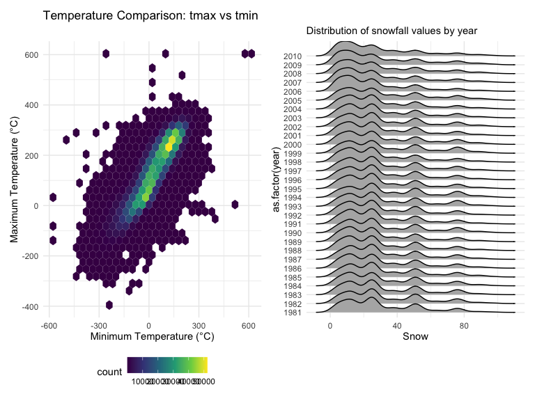
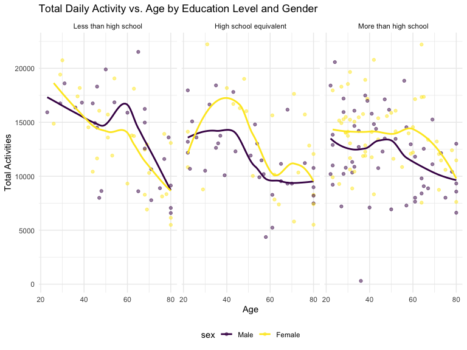
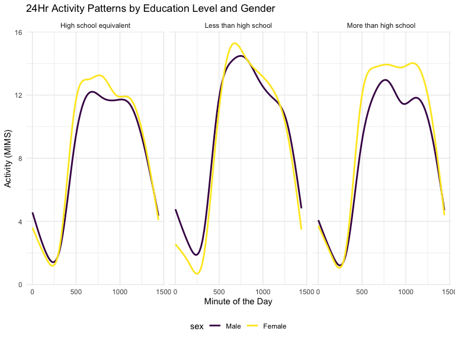

P8105 Homework 3
================

Name: Xi Peng UNI: xp2213 Date: 10.14.2024

# Question 1. Exploration of “NY NOAA” dataset

## Section 1: Data cleaning

``` r
data("ny_noaa")

weather_dat = ny_noaa |> 
  janitor::clean_names() |> 
  separate(date, into = c('year', 'month', 'day'), remove = TRUE) |>
  mutate(
    tmax = as.numeric(tmax),
    tmin = as.numeric(tmin)
  )

snow_comm = weather_dat |> 
  group_by(snow,id) |> 
  summarise(count = n()) |> 
  arrange(desc(count))
```

In the original “ny_noaa” datasets, there are 2595176 observations and
there are 7 variables included, which are: id, date, prcp, snow, snwd,
tmax, tmin. In this section, the “date” variable was separated into
year, month, and day. Temperature (“tman” and “tmin”), precipitation
(“prcp”), and snowfall(“snow”) were tranfered into reasonable units.

By checking the “snow” variable for snowfall, the result shows that
`0 cm` and `NA` are the most commonly observed values. The likely reason
is that for most of the year, these regions do not experience snowfall,
especially during warmer months. Additionally, some regions included in
the dataset may not experience snow at all throughout the year due to
their warmer climates or geographical location. These places are
unlikely to have a snow season, and as a result, `0 cm` is consistently
recorded for snowfall in these areas. The presence of `NA` values
indicates missing data, which could be due to weather stations not
recording snowfall on certain days or data collection issues.

## Section 2: Comparison of mean maximum temperature in January and July across weather stations over the years

``` r
weather_jan_jul = weather_dat |> 
  group_by(id, year, month) |> 
  mutate(
    month = as.numeric(month),
    year = as.numeric(year)
         ) |>
  filter(month %in% c(1, 7)) |>
  summarise(mean_tmax = mean(tmax, na.rm = TRUE, color = id))
```

    ## `summarise()` has grouped output by 'id', 'year'. You can override using the
    ## `.groups` argument.

``` r
weather_jan_jul_ggplot = weather_jan_jul |> 
ggplot(aes(x = year, y = mean_tmax, group = id)) +
  geom_point() + geom_path() +
  facet_grid(~month) +
  scale_x_continuous(breaks = seq(1980, 2010, by = 10)) +
  labs(
    title = "Mean Max Temperature in January and July by Stations",
       x = "Year", 
       y = "Mean Max Temperature (°C)") 

weather_jan_jul_ggplot
```


I checked the dataset and recognized there are 747 stations. One issue
that needed attention is the large number of stations in the dataset.
Including all the station labels would result in the scatterplot not
being displayed properly because of the excessive number of stations in
the legend.

According to the scatterplot, there are clear seasonal differences
between January and July temperatures. The temperatures are generally
colder in January, and warmer in July across stations and years. Due to
the large number of stations included in this dataset, without
restricting the analysis to a specific time range or a particular set of
stations, I can only observe general trends. The observable structure
shows that temperatures in January typically range from -10 °C to 10 °C,
where temperatures in July typically ranger from 20 °C to 32.5 °C.
Comparing 1981 to 2010, there appears to be a slight increase in
temperatures for both January and July, suggesting a possible warming
trend over time.There’s considerable variability both between stations
and from year to year, illustrating geographical and annual climate
differences. There are several noticeable outlines. For example, in
January 1982 and 1996, some stations recorded average maximum
temperatures below -10 °C, reflecting extremely cold winters. Also, one
station in July 1988 recorded unusually low average temperature, far
below the general trend. These anomalies could indicate extreme weather
events or errors in data recording.

## Section 3: Analysis of temperature extremes and distribution of snowfall patterns

``` r
tmax_vs_tmin_panel = weather_dat |> 
  ggplot(aes(x = tmin, y = tmax)) +
  geom_hex() +
  labs(
    title = "Temperature Comparison: tmax vs tmin",
    x = "Minimum Temperature (°C)",
    y = "Maximum Temperature (°C)"
  ) 

snowfall_distri_panel = weather_dat |> 
  filter(snow < 100, snow > 0) |> 
  ggplot(aes(x = snow, y = as.factor(year))) +
  geom_density_ridges() +
  labs(
    subtitle = "Distribution of snowfall values by year",
    x = "Snow",
    y = "as.factor(year)"
  ) 

tmax_vs_tmin_panel + snowfall_distri_panel
```



# Question 2. Analysis of accelerometer data from the NHANES study

## Section 1: Dataset import and organization

``` r
nhanes_covar_df =
    read_csv("Data/nhanes_covar.csv", na = c("NA", "", ".", " "), skip = 4) |> 
    janitor::clean_names() |> 
  drop_na() |> 
  mutate( education = as.character(education), sex = as.character(sex)
  ) |> 
    mutate(
      education = case_match(
        education,
        "1" ~ "Less than high school",
        "2" ~ "High school equivalent",
        "3" ~ "More than high school"),
      sex = case_match(
        sex,
        "1" ~ "Male",
        "2" ~ "Female"
      ))
```

    ## Rows: 250 Columns: 5
    ## ── Column specification ────────────────────────────────────────────────────────
    ## Delimiter: ","
    ## dbl (5): SEQN, sex, age, BMI, education
    ## 
    ## ℹ Use `spec()` to retrieve the full column specification for this data.
    ## ℹ Specify the column types or set `show_col_types = FALSE` to quiet this message.

``` r
nhanes_accel_df =
    read_csv("Data/nhanes_accel.csv", na = c("NA", "", ".", " ")) |> 
  janitor::clean_names()
```

    ## Rows: 250 Columns: 1441
    ## ── Column specification ────────────────────────────────────────────────────────
    ## Delimiter: ","
    ## dbl (1441): SEQN, min1, min2, min3, min4, min5, min6, min7, min8, min9, min1...
    ## 
    ## ℹ Use `spec()` to retrieve the full column specification for this data.
    ## ℹ Specify the column types or set `show_col_types = FALSE` to quiet this message.

``` r
Merged_nhanes_dat = nhanes_covar_df |> 
  inner_join(nhanes_accel_df, by = "seqn") |> 
  filter(age > 21) |> 
  mutate(
    sex = factor(sex, levels = c("Male", "Female")),
    Education = factor(education, levels = c(
      "Less than high school",
      "High school equivalent",
      "More than high school"
    )))
```

In this section, the datasets were cleaned and organized as per the
requirements, and a merged dataset was created. In this dataset, there
are 225 observations and 1446 variables.

## Section 2: Gender distribution and age trends across education categories

``` r
Sex_in_education_cate = Merged_nhanes_dat |> 
  group_by(Education, sex) |> 
  summarise(count = n()) |> 
  pivot_wider(
    names_from = sex,
    values_from = count
  )

knitr::kable(Sex_in_education_cate, caption = "Number of Men and Women in Each Education Category")
```

| Education              | Male | Female |
|:-----------------------|-----:|-------:|
| Less than high school  |   27 |     28 |
| High school equivalent |   34 |     23 |
| More than high school  |   54 |     59 |

Number of Men and Women in Each Education Category

According to the table, the number of males and females education levels
of “Less than high school” and “More than high school” are approximately
similar, inidacting a balanced distribution between genders in these
catgories. For education level of “High school equivalent”, males
outnumber females by eleven, showing that men are more likely to obtain
a high school equivalent degree compared to famles in this sample
population.

``` r
Age_distri_in_Edc_plot = Merged_nhanes_dat |> 
  ggplot(aes(x = age, fill = sex)) +
  geom_density(alpha = .4, adjust = .5) +
  facet_grid(~Education) +
  labs(
    title = "Age Distribution by Education and Gender",
    x = "Age",
    y = "Density"
  ) 

Age_distri_in_Edc_plot
```


According to the density plot, three education levels are showing
different age distributions between genders. For the “Less than high
school” education category, males have a peak between age 40 and 50,
while females show a more even distribution across age. Both genders
display a left-skewed distribution, with higher densities in older age
groups. For “High school equivalent” category, males display a
relatively uneven distribution of age with various peaks across ages,
while females show a more left-skewed distribution with a peak between
age 70 and 80. Lastly, for the “More than high school” category, both
genders demonstrate a right-skewed distribution. Females have a
prominent peak at age of 30, and males also show less pronounced peak
around that age.

## Section 3: Impact of age, gender, and education on total daily activity

``` r
Total_daily_activity = Merged_nhanes_dat |> 
  group_by(seqn, age, sex, Education) |> 
  summarise(total_activity = sum(min1:min1440, na.rm = TRUE)) |> 
  ggplot(aes(x = age, y = total_activity, color = sex)) +
  geom_point(alpha = 0.5) +
  geom_smooth(se = FALSE) +
  facet_grid(~Education) +
  labs(
    title = "Total Daily Activity vs. Age by Education Level and Gender",
    x = "Age",
    y = "Total Activities"
  )
```

    ## `summarise()` has grouped output by 'seqn', 'age', 'sex'. You can override
    ## using the `.groups` argument.

``` r
Total_daily_activity  
```

    ## `geom_smooth()` using method = 'loess' and formula = 'y ~ x'



For the first category, “Less than high school,” the overall daily total
activity appears to be low for both male and female participants, with
most data points falling below 50 in total activities. Both genders show
a slight decrease in activity as they age. The trend lines indicate that
women maintain slightly higher daily activity in middle and older ages,
while male participants tend to have higher activity levels in younger
age groups.

For participants with “High school equivalent” degrees, activity levels
remain low for both males and females. Activity decreases with age for
both genders. The trend lines suggest that there are no large
differences between men and women, although men’s activity levels
continue to decline more consistently compared to women as they age.

In the last category, “More than high school,” both genders display
higher overall activity levels compared to the other two categories,
particularly among the younger participants. Women between the ages of
20 and 60 show higher activity levels compared to men with the same
education level. The trend lines indicate a decline in men’s total
activity levels around the age of 40, while women in this group remain
consistently more active across all ages.

In general, total activity levels decrease with age across all education
categories. The differences between genders are relatively small, but
participants with higher education levels tend to have higher total
activity levels overall.

## Section 4: 24Hr activity patterns by education level and gender

``` r
hourly_activity = Merged_nhanes_dat |>
  pivot_longer(
    cols = starts_with("min"),
    names_to = "minutes",
    values_to = "activity",
    names_prefix = "min"
  ) |> 
  mutate(minutes = as.numeric(minutes)) |> 
  ggplot(aes(x = minutes, y = activity, color = sex)) +
  geom_line(alpha = 0.3) +
  geom_smooth(method = "loess", se = FALSE) +
  facet_grid(~education) +
  labs(
    title = "24Hr Activity Patterns by Education Level and Gender",
    x = "Minute of the Day",
    y = "Activity"
  )

hourly_activity
```

    ## `geom_smooth()` using formula = 'y ~ x'



# Problem 3 NYC Citi Bike System Data Exploration

## Section 1: Dataset import and clean

``` r
NYCiti_Jan_2020 =
    read_csv("Data/Jan 2020 Citi.csv", na = c("NA", "", ".", " ")) |> 
  janitor::clean_names() |> 
  mutate(
    year = 2020, month = "Jan"
  )
```

    ## Rows: 12420 Columns: 7
    ## ── Column specification ────────────────────────────────────────────────────────
    ## Delimiter: ","
    ## chr (6): ride_id, rideable_type, weekdays, start_station_name, end_station_n...
    ## dbl (1): duration
    ## 
    ## ℹ Use `spec()` to retrieve the full column specification for this data.
    ## ℹ Specify the column types or set `show_col_types = FALSE` to quiet this message.

``` r
NYCiti_Jan_2024 =
    read_csv("Data/Jan 2024 Citi.csv", na = c("NA", "", ".", " ")) |> 
  janitor::clean_names() |> 
  mutate(
    year = 2024, month = "Jan"
  )
```

    ## Rows: 18861 Columns: 7
    ## ── Column specification ────────────────────────────────────────────────────────
    ## Delimiter: ","
    ## chr (6): ride_id, rideable_type, weekdays, start_station_name, end_station_n...
    ## dbl (1): duration
    ## 
    ## ℹ Use `spec()` to retrieve the full column specification for this data.
    ## ℹ Specify the column types or set `show_col_types = FALSE` to quiet this message.

``` r
NYCiti_July_2020 =
    read_csv("Data/July 2020 Citi.csv", na = c("NA", "", ".", " ")) |> 
  janitor::clean_names() |> 
  mutate(
    year = 2020, month = "July"
  )
```

    ## Rows: 21048 Columns: 7
    ## ── Column specification ────────────────────────────────────────────────────────
    ## Delimiter: ","
    ## chr (6): ride_id, rideable_type, weekdays, start_station_name, end_station_n...
    ## dbl (1): duration
    ## 
    ## ℹ Use `spec()` to retrieve the full column specification for this data.
    ## ℹ Specify the column types or set `show_col_types = FALSE` to quiet this message.

``` r
NYCiti_July_2024 =
    read_csv("Data/July 2024 Citi.csv", na = c("NA", "", ".", " ")) |> 
  janitor::clean_names() |> 
  mutate(
    year = 2024, month = "July"
  )
```

    ## Rows: 47156 Columns: 7
    ## ── Column specification ────────────────────────────────────────────────────────
    ## Delimiter: ","
    ## chr (6): ride_id, rideable_type, weekdays, start_station_name, end_station_n...
    ## dbl (1): duration
    ## 
    ## ℹ Use `spec()` to retrieve the full column specification for this data.
    ## ℹ Specify the column types or set `show_col_types = FALSE` to quiet this message.

``` r
Total_NYCiti = 
  bind_rows(NYCiti_Jan_2020, NYCiti_Jan_2024, NYCiti_July_2020, NYCiti_July_2024) |> 
  janitor::clean_names() |> 
  group_by(year, month, member_casual) |> 
  summarise(total_riders = n())
```

    ## `summarise()` has grouped output by 'year', 'month'. You can override using the
    ## `.groups` argument.

``` r
knitr::kable(Total_NYCiti,
             col.names = c("Year", "Month", "Member Type", "Total Number of Rides"),
             caption = "Total Number of Rides by Year, Month, and Rider Type"
             )
```

| Year | Month | Member Type | Total Number of Rides |
|-----:|:------|:------------|----------------------:|
| 2020 | Jan   | casual      |                   984 |
| 2020 | Jan   | member      |                 11436 |
| 2020 | July  | casual      |                  5637 |
| 2020 | July  | member      |                 15411 |
| 2024 | Jan   | casual      |                  2108 |
| 2024 | Jan   | member      |                 16753 |
| 2024 | July  | casual      |                 10894 |
| 2024 | July  | member      |                 36262 |

Total Number of Rides by Year, Month, and Rider Type

According to the table, we can observe that the number of casual riders
is consistently lower than the number of member riders for every
combination of year and month. The total number of both casual and
member riders increased from 2020 to 2024, indicating that more people
used the service overall in 2024, with a significant increase in those
registering as members. Additionally, the number of rides taken by
member riders is substantially higher than those taken by casual riders
across all combinations of year and month, suggesting that members tend
to use Citi Bike more frequently than casual users.

## Section 2: The five most popular starting stations for July 2024

``` r
Five_most_pop_stationsJu2024 = NYCiti_July_2024 |> 
  group_by(start_station_name) |> 
  summarise(number_of_rides = n()) |> 
  arrange(desc(number_of_rides)) |> 
  head(5)

knitr::kable(Five_most_pop_stationsJu2024,
             col.names = c("Start Station Name", "Total Number of Rides"),
             caption = "The Top Five Starting Stations for July 2024"
             )
```

| Start Station Name       | Total Number of Rides |
|:-------------------------|----------------------:|
| Pier 61 at Chelsea Piers |                   163 |
| University Pl & E 14 St  |                   155 |
| W 21 St & 6 Ave          |                   152 |
| West St & Chambers St    |                   150 |
| W 31 St & 7 Ave          |                   146 |

The Top Five Starting Stations for July 2024

## Section 3:
