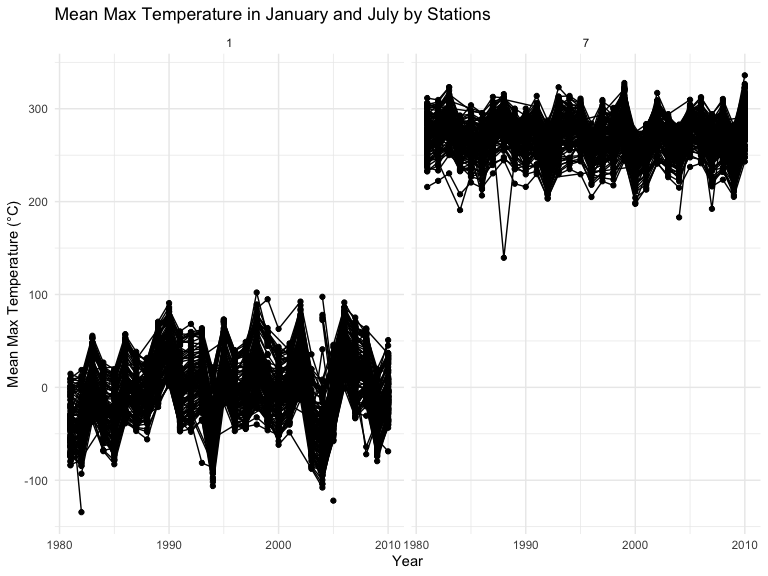

P8105 Homework 3
================

Name: Xi Peng UNI: xp2213 Date: 10.14.2024

# Question 1. Exploration of “NY NOAA” dataset

## Section 1: Data cleaning

``` r
data("ny_noaa")

weather_dat = ny_noaa |> 
  janitor::clean_names() |> 
  separate(date, c('year', 'month', 'day'), sep ='-', remove = TRUE) |>
  mutate(
    tmax = as.numeric(tmax) / 10,
    tmin = as.numeric(tmin) / 10,
    prcp = prcp / 10,
    snow = snow / 10,
  )

snow_comm = weather_dat |> 
  group_by(snow,id) |> 
  summarise(count = n()) |> 
  arrange(desc(count))
```

In the original “ny_noaa” datasets, there are 2595176 observations and
there are 7 variables included, which are: id, date, prcp, snow, snwd,
tmax, tmin. In this section, the “date” variable was separated into
year, month, and day. Temperature (“tman” and “tmin”), precipitation
(“prcp”), and snowfall(“snow”) were tranfered into reasonable units.

By checking the “snow” variable for snowfall, the result shows that
`0 cm` and `NA` are the most commonly observed values. The likely reason
is that for most of the year, these regions do not experience snowfall,
especially during warmer months. Additionally, some regions included in
the dataset may not experience snow at all throughout the year due to
their warmer climates or geographical location. These places are
unlikely to have a snow season, and as a result, `0 cm` is consistently
recorded for snowfall in these areas. The presence of `NA` values
indicates missing data, which could be due to weather stations not
recording snowfall on certain days or data collection issues.

## Section 2: Comparison of average maximum temperature in January and July across weather stations over the years

``` r
weather_jan_jul = weather_dat |> 
  group_by(id, year, month) |> 
  mutate(month = as.numeric(month)) |>
  filter(month %in% c(1, 7)) |>
  summarise(mean_tmax = mean(tmax, na.rm = TRUE, color = id))
```

    ## `summarise()` has grouped output by 'id', 'year'. You can override using the
    ## `.groups` argument.

``` r
weather_jan_jul_ggplot = weather_jan_jul |> 
ggplot(aes(x = year, y = mean_tmax, group = id)) +
  geom_point() + geom_path() +
  facet_grid(~month) +
  labs(
    title = "Mean Max Temperature in January and July by Stations",
       x = "Year", 
       y = "Mean Max Temperature (°C)") 

weather_jan_jul_ggplot
```



I checked the dataset and recognized there are 747 stations. One issue
that needed attention is the large number of stations in the dataset.
Including all the station labels would result in the scatterplot not
being displayed properly because of the excessive number of stations in
the legend.

According to the scatterplot, there are clear seasonal differences
between January and July temperatures. The temperatures are generally
colder in January, and warmer in July across stations and years. Due to
the large number of stations included in this dataset, without
restricting the analysis to a specific time range or a particular set of
stations, I can only observe general trends. The observable structure
shows that temperatures in January typically range from -10 °C to 10 °C,
where temperatures in July typically ranger from 20 °C to 32.5 °C.
Comparing 1981 to 2010, there appears to be a slight increase in
temperatures for both January and July, suggesting a possible warming
trend over time.There’s considerable variability both between stations
and from year to year, illustrating geographical and annual climate
differences. There are several noticeable outlines. For example, in
January 1982 and 1996, some stations recorded average maximum
temperatures below -10 °C, reflecting extremely cold winters. Also, one
station in July 1988 recorded unusually low average temperature, far
below the general trend. These anomalies could indicate extreme weather
events or errors in data recording.

## Section 3: Analysis of temperature extremes and distribution of snowfall patterns

``` r
tmax_vs_tmin_panel = weather_dat |> 
  ggplot(aes(x = tmin, y = tmax)) +
  geom_hex() +
  labs(
    title = "Temperature Comparison: tmax vs tmin",
    x = "Minimum Temperature (°C)",
    y = "Maximum Temperature (°C)"
  ) 

snowfall_distri_panel = weather_dat |> 
  filter(snow < 100, snow > 0) |> 
  ggplot(aes(x = snow, y = as.factor(year))) +
  geom_density_ridges() +
  labs(
    subtitle = "Distribution of snowfall values by year",
    x = "Snow",
    y = "as.factor(year)"
  ) 

tmax_vs_tmin_panel + snowfall_distri_panel
```


# Question 2. Analysis of accelerometer data from the NHANES study

## Section 1: Dataset import and organization

``` r
nhanes_covar_df =
    read_csv("nhanes_covar.csv", na = c("NA", "", ".", " "), skip = 4) |> 
    janitor::clean_names() |> 
  drop_na() |> 
  mutate( education = as.character(education), sex = as.character(sex)
  ) |> 
    mutate(
      education = case_match(
        education,
        "1" ~ "Less than high school",
        "2" ~ "High school equivalent",
        "3" ~ "More than high school"),
      sex = case_match(
        sex,
        "1" ~ "Male",
        "2" ~ "Female"
      ))
```

    ## Rows: 250 Columns: 5
    ## ── Column specification ────────────────────────────────────────────────────────
    ## Delimiter: ","
    ## dbl (5): SEQN, sex, age, BMI, education
    ## 
    ## ℹ Use `spec()` to retrieve the full column specification for this data.
    ## ℹ Specify the column types or set `show_col_types = FALSE` to quiet this message.

``` r
nhanes_accel_df =
    read_csv("nhanes_accel.csv", na = c("NA", "", ".", " ")) |> 
  janitor::clean_names()
```

    ## Rows: 250 Columns: 1441
    ## ── Column specification ────────────────────────────────────────────────────────
    ## Delimiter: ","
    ## dbl (1441): SEQN, min1, min2, min3, min4, min5, min6, min7, min8, min9, min1...
    ## 
    ## ℹ Use `spec()` to retrieve the full column specification for this data.
    ## ℹ Specify the column types or set `show_col_types = FALSE` to quiet this message.

``` r
Merged_nhanes_dat = nhanes_covar_df |> 
  inner_join(nhanes_accel_df, by = "seqn") |> 
  filter(age > 21) |> 
  mutate(
    sex = factor(sex, levels = c("Male", "Female")),
    Education = factor(education, levels = c(
      "Less than high school",
      "High school equivalent",
      "More than high school"
    )))
```

In this section, the datasets were cleaned and organized as per the
requirements, and a merged dataset was created.

## Section 2:Gender distribution and age trends across education categories

``` r
Sex_in_education_cate = Merged_nhanes_dat |> 
  group_by(education, sex) |> 
  summarise(count = n()) |> 
  pivot_wider(
    names_from = sex,
    values_from = count
  )

knitr::kable(Sex_in_education_cate, caption = "Number of Men and Women in Each Education Category")
```

| education              | Male | Female |
|:-----------------------|-----:|-------:|
| High school equivalent |   34 |     23 |
| Less than high school  |   27 |     28 |
| More than high school  |   54 |     59 |

Number of Men and Women in Each Education Category

``` r
Age_distri_in_Edc_plot = Merged_nhanes_dat |> 
  ggplot(aes(x = age, fill = sex)) +
  geom_density(alpha = 0.5) +
  facet_wrap(~education) +
  labs(
    title = "Age Distribution by Education and Gender",
    x = "Age",
    y = "Density"
  ) +
  theme_minimal() +
  theme(legend.position = "bottom") 

Age_distri_in_Edc_plot2 = Merged_nhanes_dat |> 
  ggplot(aes(x = age, fill = sex)) +
 geom_histogram(position = "dodge", binwidth = 2) +
  facet_wrap(~education) +
  labs(
    title = "Age Distribution by Education and Gender",
    x = "Age",
    y = "Density"
  ) +
  theme_minimal() +
  theme(legend.position = "bottom") 
```
